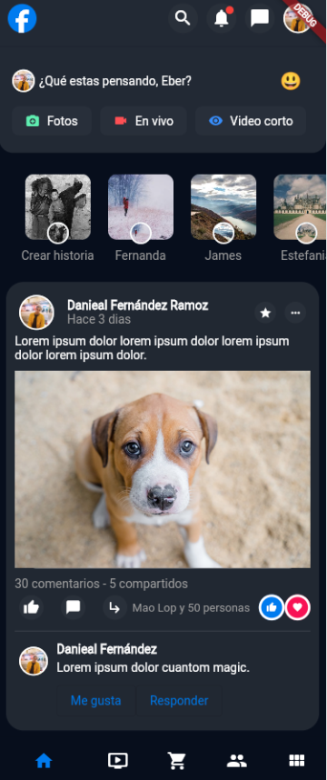
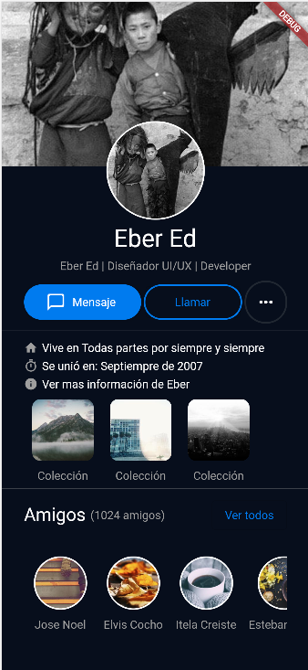

# fb_design

Este proyecto solo es un intento de maquentación en **Flutter** del [diseño de facebook](https://dribbble.com/shots/15479224-Facebook-Redesign-Concept/attachments/7253134?mode=media) como reto de propuesto por los chicos de _We Devs_

El resultado por ahora es el que vez a abajo.
En este caso elegimos el modo dark
Existen muchas cosas por mejorar
La funcionalidad aún es un misterio

<table>
    <tr>
    <td>
        </img>
    </td>
    <td>
        </img>
    </td>
    </tr>
</table>
