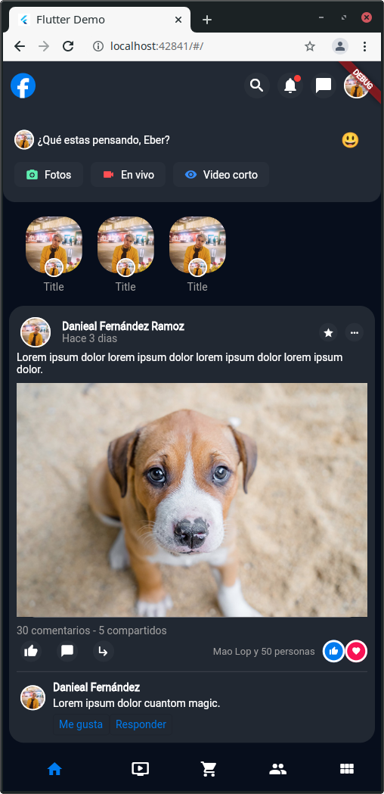

# fb_design

Este proyecto solo es un intento de maquentación en **Flutter** del [diseño de facebook](https://dribbble.com/shots/15479224-Facebook-Redesign-Concept/attachments/7253134?mode=media) como reto de propuesto por los chicos de _We Devs_

<table>
    <tr>
    <td>
        </img>
    </td>
    <td>
        

        El resultado por ahora es el que vez a la izq. 
        En este caso elegimos el modo dark 
        Existen muchas cosas por mejorar 
        La funcionalidad aún es un misterio 
        

    </td>
    </tr>
</table>
